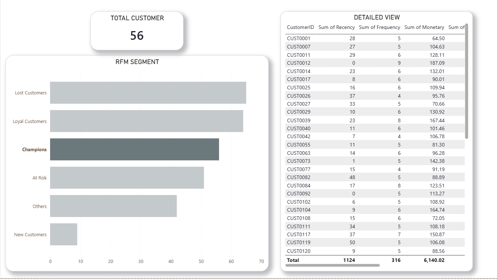

# RFM Customer Segmentation

## Overview
This project applies RFM analysis (Recency, Frequency, Monetary) to segment customers based on purchase behavior and support data-driven marketing decisions.

## Objectives
- Measure how recently each customer purchased.
- Measure how often each customer purchases.
- Measure how much each customer spends.
- Group customers into meaningful segments for action.

## Project Workflow
1. Prepare and merge sales data using SQL.
2. Calculate Recency, Frequency, and Monetary metrics.
3. Score customers and assign them to RFM segments.
4. Build a Power BI dashboard for exploration and reporting.

## Tech Stack
- SQL (BigQuery-compatible)
- Power BI

## Repository Structure
- `rfm_analysis.sql`: SQL logic for RFM calculations and segmentation.
- `README.md`: Project documentation.
- `dashboard.PNG`: Dashboard screenshot.

## Output
- Customer segments such as Champions, Loyal, At Risk, and Lost.
- Interactive dashboard for segment-level analysis.

## Dashboard Preview
